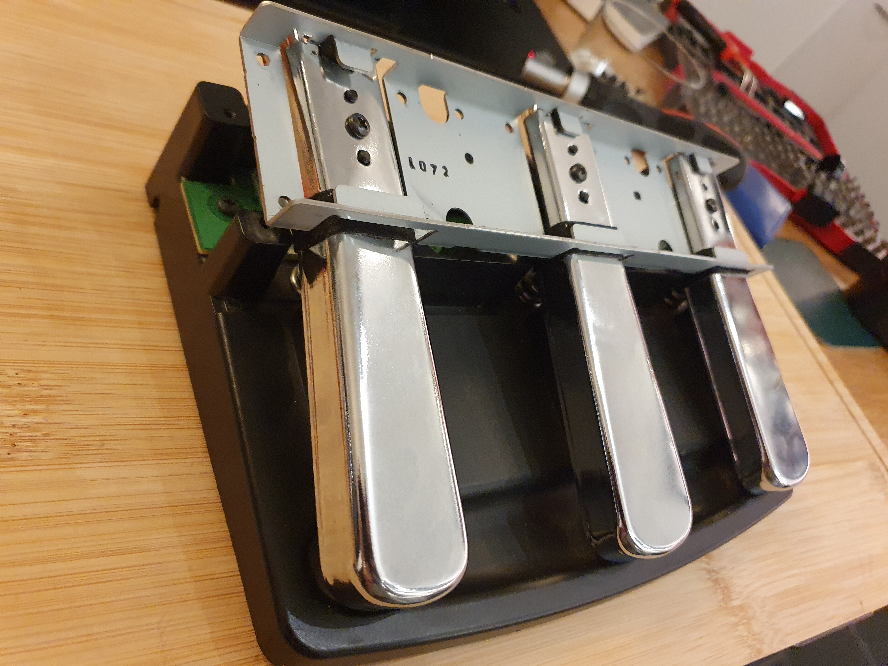

# Vim clutch & push-to-talk.

## Steps
1. Find a Korg piano foot pedal
2. Hook it up to an ESP-32
3. Burn esphome to it
4. Write a simple python script to shell out to `xdotool` to send the `i` to go to insert mode, and `Escape` to exit to command mode again. Also use `amixer` to (un)mute the microphone.
5. Profit! (or at least, I had fun building this :))

## Software
- [ESPHome configuration](kludges.yaml)
- [Python script](kludge.py)

## Hardware

The original module

The pedals are pushed up by strong springs

This is the print containing all the interesting bits.
There is a common source (I put 3v on it), and three lanes for the three pedals.
Each pedal has three buttons that have less resistance if pushed harder.

The first and second button (from back to front) of the pedal have both an 10k ohm resistor, replaced them with 150 ohm.
The third one is connected directly to the lane for that pedal.

I'm using ADC ports 3, 4 & 5.
To let the voltage drain away after the pedal is pressed, I've connected the ports to ground with more 150 ohm resistors.

It fits quite well at the bottom of the pedal case. Had to break out some plastic to make room, but it fits quite well!

Demo video

